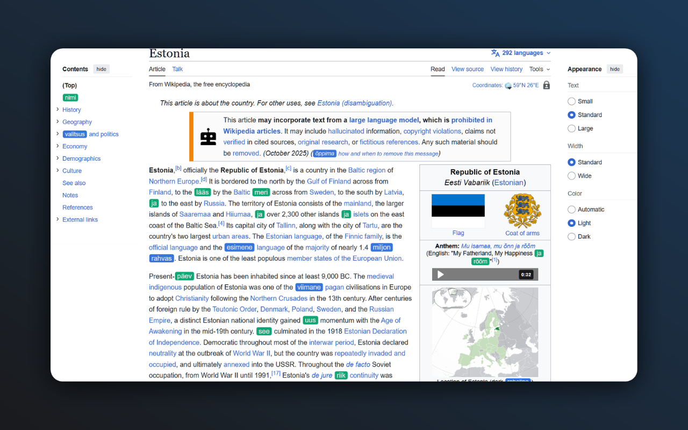
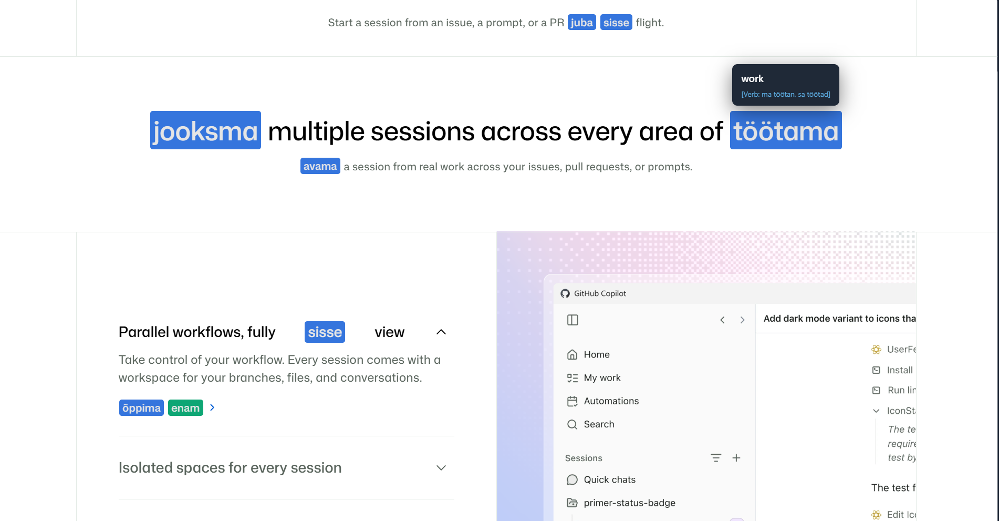
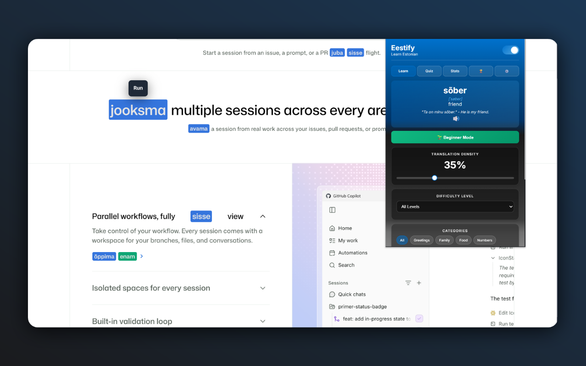

# Eestify

A Chrome extension that helps you learn Estonian while browsing the web.

## How it works

Eestify replaces English words on any webpage with their Estonian translations. Words are color-coded by difficulty. The more you browse, the more you learn.

## Features

- Replaces English text with Estonian translations as you browse
- Hover over a translated word to see the original English
- Click a word to toggle between Estonian and English
- Right-click a word to hear its pronunciation
- Double-click a word to save it to your favorites
- Select any text and double-click to translate it to Estonian
- Quiz mode to test your knowledge
- Word of the day
- Progress tracking and achievements
- Custom word lists
- Site blacklist to disable on certain sites
- Adjustable translation density
- Difficulty levels and categories
- Dark mode support
- Keyboard shortcuts (Alt+E to toggle, Alt+Q to open popup)

## Installation

1. Download or clone this repository
2. Open Chrome and go to chrome://extensions
3. Enable Developer mode (top right)
4. Click "Load unpacked" and select the Eestify folder

## Usage

Open any webpage and Eestify will automatically replace some English words with Estonian translations. Click the extension icon in your toolbar to open the settings popup where you can adjust preferences.

## Keyboard shortcuts

- Alt+Q: Open the Eestify popup
- Alt+E: Toggle Eestify on and off

## Screenshots

